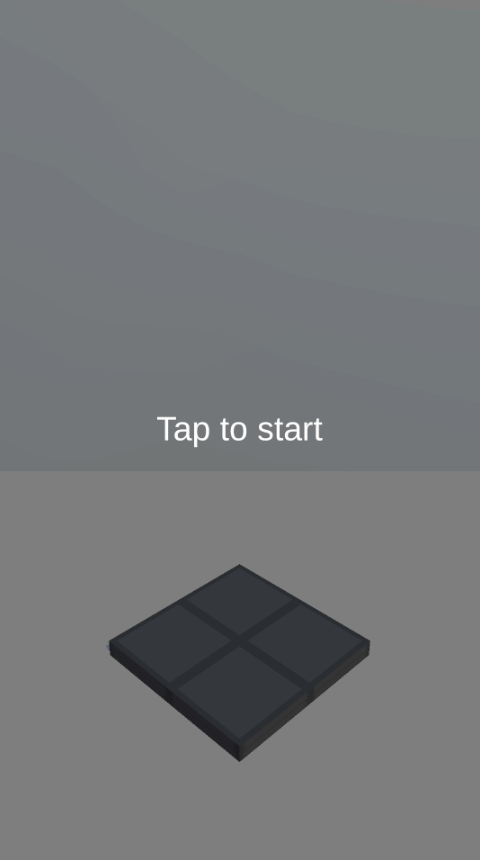
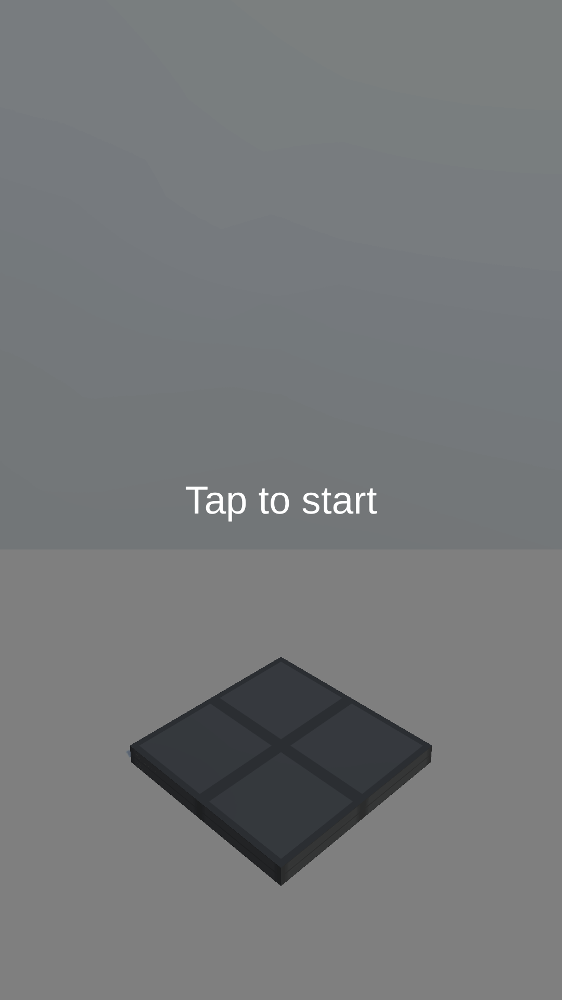
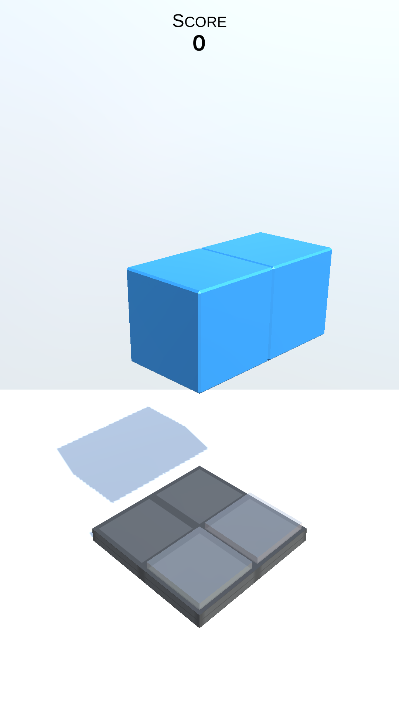
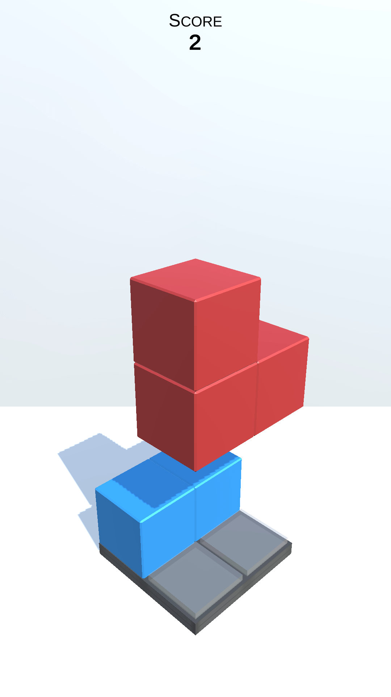
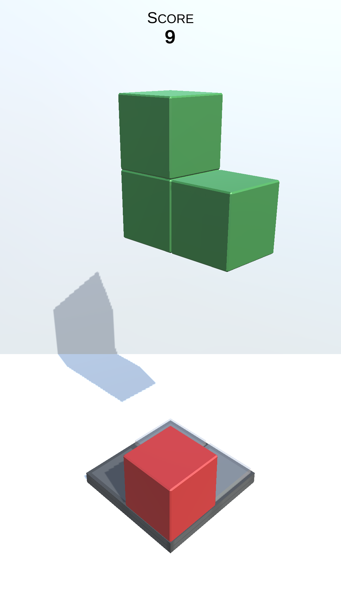
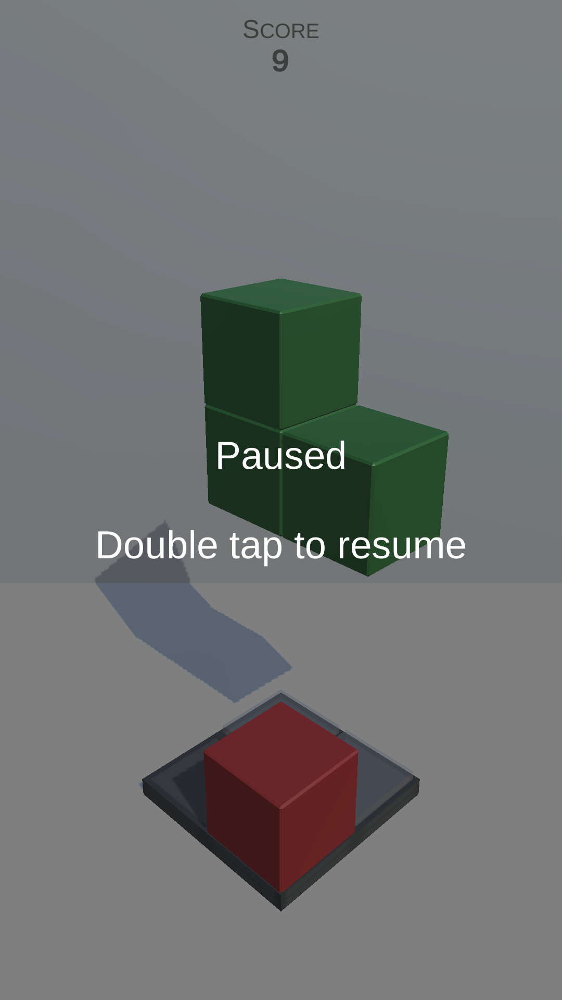
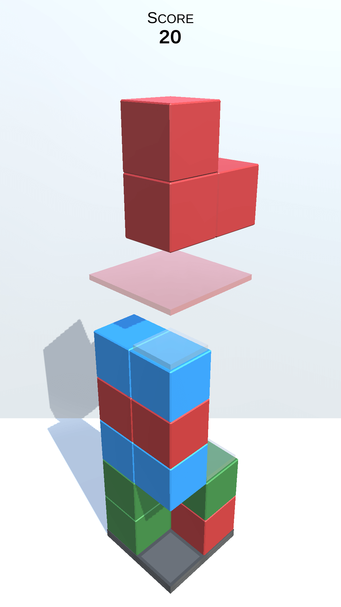
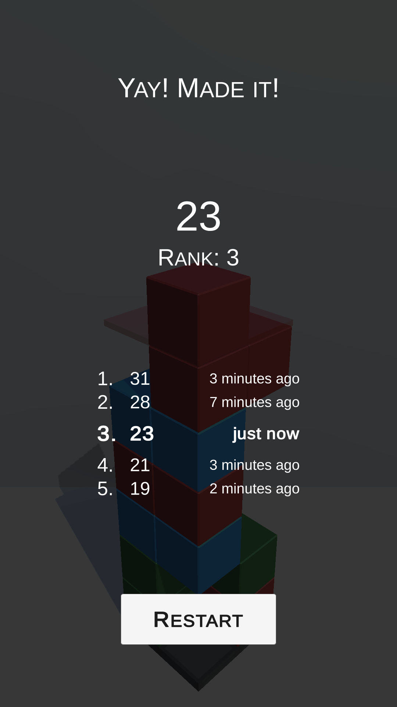

# Bloxyz

This is my attempt of cloning [Kubik from Ketchapp](https://play.google.com/store/apps/details?id=com.ketchapp.kubik&hl=pl).

## Try it

For Android (Min 4.4 'KitKat'): [Download apk and install](https://github.com/dbpienkowska/bloxyz/raw/master/Game/Bloxyz_apk.zip)

## Changes in mechanics

**There had to be differences, of course.**

- Blocks fall one level, not all the way down

   _More like classic Tetris. I also find it more challenging._

- Original scoring system

   _Place blocks and finish levels - get more points the longer you play._

- Different platform size

   _Parametrized, currently set 2x2._
   
- Swipe controls

   _I like the feel of swiping._

## Implemented features

**Things you don't see on screen, only available for the chosen ones by the Unity editor.**

### Game state
- Configurable platform size and level limit
- Playable on mobile (touch input) and pc (keyboard input)
- SQLite database to save scores

### Spawning
- Block types in prefabs (could make more)
- Spawned block selection criteria 
   - Random
   - First
   - Last
- Spawned block coloring method
   - Random
   - Sequence
   - First
   - Last
- Option to create color palettes (Scriptable Objects)
- Spawned block positioning criteria
   - Random
   - Start
   - End
- Spawned block rotating criteria 
   - Random
   - None
   - One Turn
   - One Counter Turn
   - Half Turn)

### Falling
- Configurable start and max falling speed and the speed of quick landing (on swipe down)
- Parametrized time max speed is reached and speed increase curve
- Configurable distance when level limit is shown

### Interaction
- Configurable platform rotation duration
- Blocking rotation when near landing or making blocks pufff!

### Camera
- Configurable camera movement (duration and translation) after placing and destroying blocks 

### Scoring points
- Increasing earned points multiplier based on a curve
- Parametrized max points multiplier and time to achieve max multiplier

## Screenshots

      

